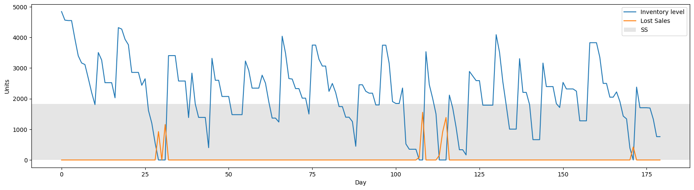

# Reorder Policies

This code show how the policy of constant reorder period impacts the inventory. 

For each simulation you can get an inventory time plot showing how many lost sales you got.

In order to create a model for a product you must input the following data:
* **Yearly Demand**: mean and deviation
* **vendor lead time**: mean and deviation. How long do products take to arrive since you order them
* **Costs**: holding, transaction (fixed and variable), stock out
* **Minimum Order Size**
* **Review Periods**: how often will you review stock

You can find an example on how to run it in to [Simulate example](simulate.ipynb) file.

This model is useful to calculate metrics and to extract the mean values after doing N simulations.